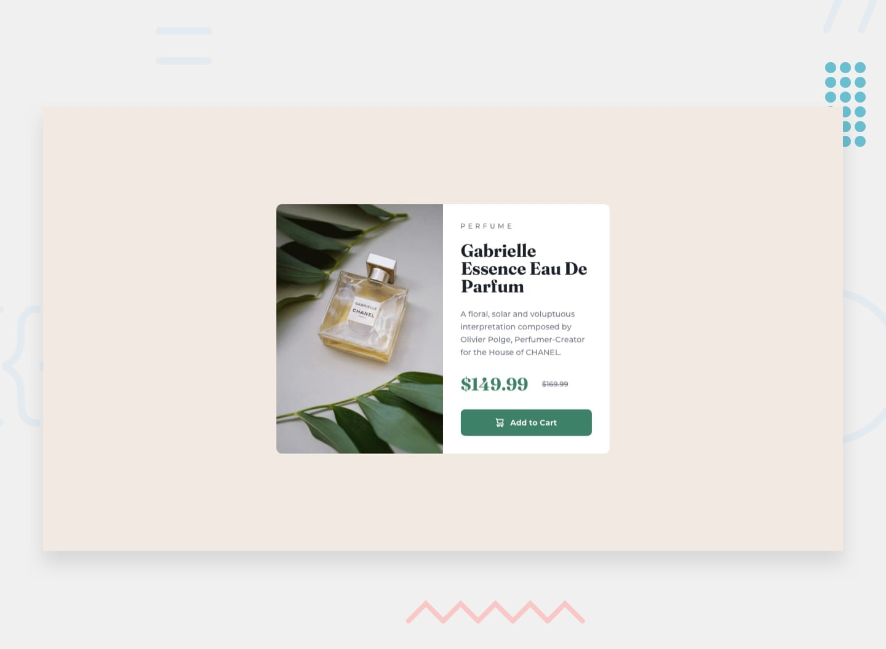

# Frontend Mentor - Product preview card component

## Welcome! 👋

Thanks for checking out this front-end coding challenge.

[Frontend Mentor](https://www.frontendmentor.io) challenges help you improve your coding skills by building realistic projects.

## The challenge

Your challenge is to build out this product preview card component and get it looking as close to the design as possible.

You can use any tools you like to help you complete the challenge. So if you've got something you'd like to practice, feel free to give it a go.

Your users should be able to:

- View the optimal layout depending on their device's screen size
- See hover and focus states for interactive elements
- https://www.frontendmentor.io/challenges/product-preview-card-component-GO7UmttRfa

## Links
 
 - Live Site URL: (https://hregniez.github.io/qr-code-component-main/)

## My process

- Git and Github setup to feel confortable with their fonctionnalities
- HTML structure implementing Emmet and BEM methodologie
- Style my HTML with my new SCSS/SASS setup !
- Animate button

### Built with

HTML
- Semantic HTML5
+ Emmet
+ BEM method

CSS
- Flexbox
- Media Queries
+ SCSS/SASS
  + Variables
+ Mobile-first workflow

Git/Github

## Author

- Github - [HRegniez] https://github.com/HRegniez
- LinkedIn - https://www.linkedin.com/in/henri-regniez/
- Mail - henriregniez124@gmail.com
